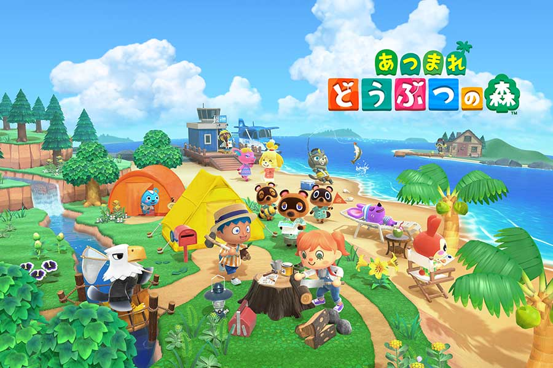

### 1. A description of the problem and a discussion of the background.
　　Recent years as the Internet develops,many interesting contents can be accessed easily.For example,comics and games.When it comes to comics,many people may have Japan in their 
mind.

    

　　Japan has become one of the most popular countries in the world by its high quality industrial products and its unique culture.In the year 2019,the total foreign travelers 
in Japan is about 32 million.Under this background,I want to make some information for all the people who are interested in Japan by grouping several Japanese major cities into 
different types.Hope this project will help when you want to make commercial recommends about traveling or select a place to live in Japan.

    

### 2. A description of the data and how it will be used to solve the problem.
There are 47 prefectures in Japan.I plan to take their 47 capital cities out and explore their common and difference.Since it's not a big deal I will just list them out 
instead of scraping.Then by using API I can get the cordinates and explore them to get their recommended venues.By comparing the venue categories using machine learning I can 
figure out if they are more like or different from each other.
