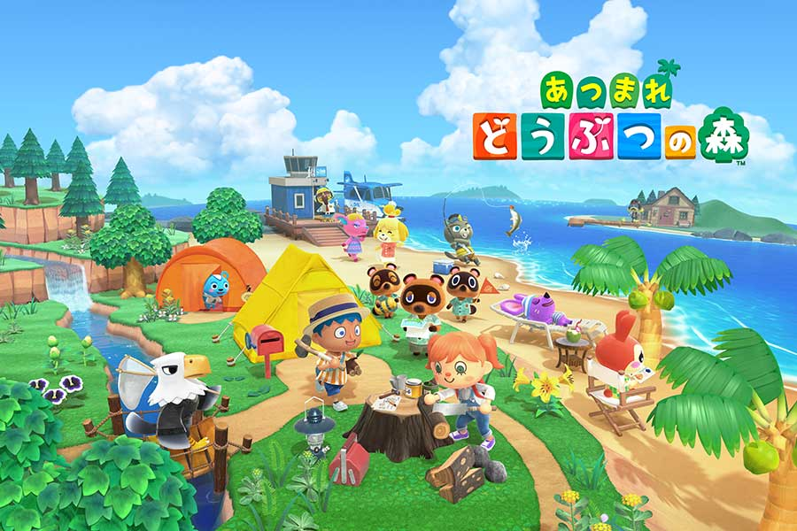

### 1. Introduction
　　Recent years as the Internet develops,many interesting contents can be accessed easily.For example,comics and games.When it comes to comics,many people may have Japan in their 
mind.

    

　　Japan has become one of the most popular countries in the world by its high quality industrial products and its unique culture.In the year 2019,the total foreign travelers 
in Japan is about 32 million.Under this background,I want to make some information for all the people who are interested in Japan by grouping several Japanese major cities into 
different types.Hope this project will help when you want to make commercial recommends about traveling or selecting a favorite place to live in Japan.

    

### 2. Data Requirement
　　There are 47 prefectures in Japan.I plan to take their 47 capital cities out and explore their common and difference.Since it's not a big deal I will just list them out 
instead of scraping.Then by using API I can get the cordinates and explore them to get their recommended venues.I noticed query using explore without any other keyword limits,
it will have a bad effect on the result,so I will also try other keywords to retrive the result to get better features.At last,I will use K-Means to figure out if the cities 
are more like or different from each other and compare which of the two different methods is better.

### 3.Methodology
#### 3.1 Data Preparation
1. First,my purpose is to cluster 47 major cities I just list them out manually.
2. Second,I get coordinates information using Geopy API.
3. 3nd,use folium API to visualize geographic details of Nagoya city to get the basic idea of what the data like.

#### 3.2 Data Analysis
1. I visualised the data features and think the feature catogory is a good one to cluster cities as it contains the recommendation info and may indicate what kind of place this city is.
As for other features such as latitude,longitude are less important for Japan doesn't have an extreme development unbalance among different parts.So I just dropped them.
2. At first I used the default parameter of radius = 500,which did good in previous lab assignments.However,after several tries,I found that many cities are clustered into wrong
groups,after analysis I realized that radius = 500 is too small and the coordinates I got by API doesn't give the central position of a city.So many cities lost their key features,
in order to avoid this i expand the radius to 5000 and finally I got a better result.
3. The catogory info is a text info which can't be used directly for machine learning,in order to make it useful,I used one-hot encode to deal with it.Then use pandas group function
I got the final features.
4. Since the problem is to cluster the cities,with good features K-Means can manage it so I chosed it to be my final algorithm.

### 4.Result
1. I used features abstracted by previous steps,and what I got is not a satisfying result.I got apparently different cities like historic cities and industrial cities grouped into
the same one.And I got 2 groups which I failed to tell the difference between them.What's more I got Tokyo and Kyoto grouped as the same with some rural cities.It's unacceptable.
2. After analysis I found the features I got are not good.I just abstracted the features using a query which will retrive all the places can be found in the database without 
any other considerations.For example,when comparing a traveling city and a industrial city,of course both will have reataurants and convenience stores and hotels,the 
difference is a traveling city will have more popularity on tour spots.So to get better features,I have to consider this,and use section=topPicks keyord which will 
retrive a mix of recommendations and sortByPopularity keyword to sort the results by popularity.After doing in this way,I got a relatively acceptable result.

### 5.Discussion
1. The most important thing I noticed is the information you can get from API is very important.If you working with wrong information,you get wrong result.How to retrive correct 
information is important.In this project,all the features share the same weight,it's not good.For every city has restaurent and hotels and Ramen shop.What makes them different is
 their key features like historic sites or park(It's the case of Tokyo).In order to use these key features,you can just order them and use less features as input like 5 instead of 10.
2. Maybe if you want to use more features you don't want to skip the least information you can get,you may try other algorithms which you can re-weight the different features.Like,
 you will give more attention to features like castle,park,Chinese restaurant(which means more foreigners).What k-Means does bad is it taking them all the same.It won't cluster 
 good because it's not using the features in a good way.
 
### 6.Conclusion
　　Through this work, I realised that there are so many information can be used to make wonderful things,maybe someday I will try to make a new product using the knowledge I learnt in this course.
Perhaps you think these information doesn't tell important things,for you knew it by common sense.That may be true,but it deponds.Before taking this course I thought in that way,but 
as I learning I found it not true.It only depends on how you use there information.  
　　Thus,while studying new technology being a creative person is the same important for skills can be got if you work hard but ideas not.Remeber that trying to use data to solve problem is a start.If you just learnt this course and don't think in a data scientist way,you learnt nothing.That's not what we want to see.So,maybe try to change our mind is the same important.
